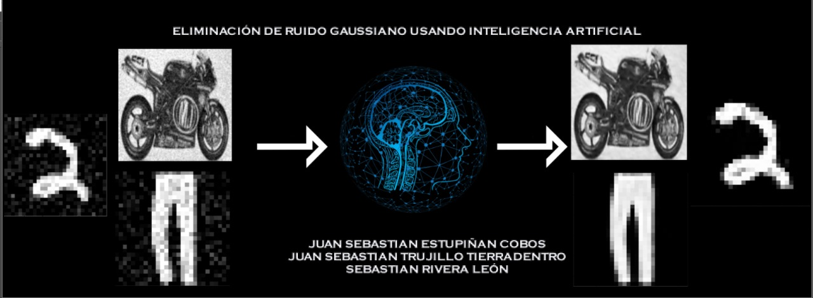

# Image Denoising (Gaussian noise reduction)

En este proyecto abordamos diferentes técnicas de IA para la reducción del ruido gausiano. Las estrategias implementadas fueron:

- Regresores (Decsion Tree, Support Vector Regressor, Random Forest).
- Redes neuronales.
- Redes neuronales convolucionales.

## Link del video: https://www.youtube.com/watch?v=2D00poyd0ok